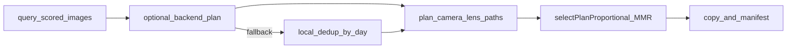

# Backup feature specification (Gallery)

Canonical specification for the **Backup** feature in **image-scoring-gallery** (Electron main process, DB layer, preload, `BackupModal`). File references are repo-relative.

## Overview

Backup exports high-quality originals from the indexed gallery database to a user-chosen folder (often an external drive). It applies **score filtering**, **stack pre-filter**, **embedding similarity dedup** with **MMR multi-keep** per cluster, optional **cross-day dedup**, and **MMR-aware disk budgeting**. Selection runs **locally in Electron**; when the Python backend is reachable, **`POST /api/backup/plan`** may supply the candidate set (gallery falls back to local logic on failure).

**Default behavior is additive:** existing files on the destination are kept unless **`pruneStaleFiles`** or **`pruneDroppedForSpace`** are explicitly enabled in config.

---

## Configuration (`config.json` → `backup` section)

| Key | Default | Description |
|-----|---------|-------------|
| `minScore` | `0.5` | Minimum `score_general` (0–1) for candidates |
| `diversityLambda` | `0.7` | MMR balance (1 = score only, 0 = diversity only) |
| `maxPerCluster` | `2` | Max keepers per similarity cluster when disk allows |
| `crossDayDedup` | `false` | Dedup across days within camera+lens+week buckets |
| `pairBatchSize` | `500` | Max IDs per pgvector pair-query batch |
| `pruneStaleFiles` | **`false`** | When true, delete destination files no longer in the current plan (mirror mode) |
| `pruneDroppedForSpace` | **`false`** | When true, delete destination copies dropped for insufficient disk space |

Parsed by [`electron/backupConfig.ts`](../../electron/backupConfig.ts). `maxPerCluster` is scaled down when destination free space is tight (`effectiveMaxPerCluster`).

Use **`minScore: 0.7`** for a curated export; **`0` or `0.5`** for broader archives.

---

## Pipeline (`backup:run` in `electron/main.ts`)

1. Load `manifest.json` (or empty).
2. Query **`getAllScoredImagesForBackup(minScore)`** — includes `capture_date`, `stack_id`.
3. Estimate disk pressure → dynamic similarity threshold + effective `maxPerCluster`.
4. **Selection** (one of):
   - **Backend:** `POST /api/backup/plan` when API health check passes.
   - **Local:** [`deduplicateByDateGroups`](../../electron/backupSelection.ts) — stack pre-filter (top 2 per stack), batched pair queries, BFS clusters, MMR multi-keep; optional `applyCrossDayDedup`.
5. Batch **`getImageDetailsBatch`** + **`getEmbeddingsBatch`** for layout and space MMR.
6. Plan paths `camera/lens/year/date/basename`; skip unresolved `_unknown_camera` / `_unknown_lens`.
7. **`syncStaleBackupEntries`** — remove manifest rows not in the current plan; **unlink files only when `pruneStaleFiles: true`**. Prebuild entries (`id: 0`) are never unlinked unless the user confirms a mass delete.
8. Incremental skip via manifest size match.
9. **`selectPlanProportional`** with `diversityLambda` for MMR backfill under byte budget. Dropped items are **not deleted** unless `pruneDroppedForSpace: true` — and when enabled, deleting already-on-disk dropped copies is subject to the **same mass-delete confirmation gate** as stale prune. All destructive confirmation gates are evaluated **before** any file is unlinked.
10. Copy files + XMP sidecars; write `manifest.json` **atomically** (temp file + `fsync` + rotate previous to `.bak` + rename) so a crash mid-write cannot corrupt the manifest.

---

## Stale cleanup and prebuild manifests

| Mode | Manifest rows not in plan | Files on disk |
|------|----------------------------|---------------|
| Default (`pruneStaleFiles: false`) | Removed from manifest | **Kept** |
| Mirror (`pruneStaleFiles: true`) | Removed | Unlinked if in plan exclusion |
| Prebuild (`id: 0`) + mirror, no confirm | Removed | **Kept** (protected) |
| Prebuild + mirror + user confirm | Removed | Unlinked |

[`scripts/prebuild-backup-manifest.mjs`](../../scripts/prebuild-backup-manifest.mjs) creates manifests with `id: 0`. Running a scored backup after prebuild is safe with default config (additive).

Mass delete confirmation is required when **either** stale file deletes **or** space-dropped on-disk deletes exceed **100** files or **10%** of the manifest (`requiresStaleDeleteConfirmation`). The pre-flight (`BackupPreviewInfo`) reports both `wouldDeleteFiles` and `wouldDeleteDroppedForSpace`.

> **Selection note:** images with `stack_id = NULL` are distinct photos the culling phase did not group; the per-date stack pre-filter keeps each as its own singleton and never trims them against one another (only real shared `stack_id` groups are capped at the top 2). Mirrored in backend `_stack_prefilter`.

Audit tool: [`scripts/audit-backup-manifest-diff.mjs`](../../scripts/audit-backup-manifest-diff.mjs).

---

## Deduplication

### Grouping

**`backupDateKey(img)`** in [`electron/backupSelection.ts`](../../electron/backupSelection.ts): prefer DB **`capture_date`** (`YYYY-MM-DD`); fallback first ISO date in path; else `unknown`.

### Similarity

- Dynamic threshold **0.80–0.99** from disk fill ratio + burst density (`stack_id` ratio).
- **`getSimilarPairsInGroup`** — pgvector cosine pairs; failures surface in **`BackupResult.warnings`**.
- Large date groups: **batched** pair queries + cross-batch merge.
- Per cluster: keep **1–maxPerCluster** images via **MMR** when `maxPerCluster > 1`.

---

## IPC

| Channel | Payload |
|---------|---------|
| `backup:preview` | `targetPath` → `BackupPreviewInfo` (pre-flight counts) |
| `backup:run` | `{ targetPath, confirmMassDelete? }` |
| `backup:progress` | `BackupProgress` |
| `backup:check-target` | manifest summary |

**`BackupPreviewInfo`:** `minScore`, `candidateCount`, `plannedCount`, `manifestCount`, `wouldDeleteFiles`, `requiresConfirm`, etc.

**`BackupResult`:** `copied`, `skipped`, `deduplicated`, `errors`, `staleRemoved`, `manifestPruned`, `prebuildProtected`, `droppedForSpace`, optional **`warnings`**.

---

## Backend API (optional)

**`POST /api/backup/plan`** — [`modules/backup_plan.py`](https://github.com/synthet/image-scoring-backend/blob/main/modules/backup_plan.py) in sibling **image-scoring-backend**. Same selection semantics; gallery uses local modules when API is down.

---

## Key modules

| File | Role |
|------|------|
| `electron/backupConfig.ts` | Config parsing + confirmation thresholds |
| `electron/backupPipeline.ts` | Shared plan build for preview/run |
| `electron/backupSelection.ts` | Grouping, stack filter, batched dedup, cross-day |
| `electron/backupDiversity.ts` | MMR selection |
| `electron/backupSpace.ts` | Disk budget, stale manifest sync, optional file prune |
| `electron/db.ts` | Queries, embeddings batch |
| `src/components/Backup/BackupModal.tsx` | UI + pre-flight + mass-delete confirm |

---

## Tests

- `electron/backupConfig.test.ts`
- `electron/backupSelection.test.ts`
- `electron/backupDiversity.test.ts`
- `electron/backupSpace.test.ts` (includes prune safety regression tests)
- Backend: `tests/test_backup_plan.py`
