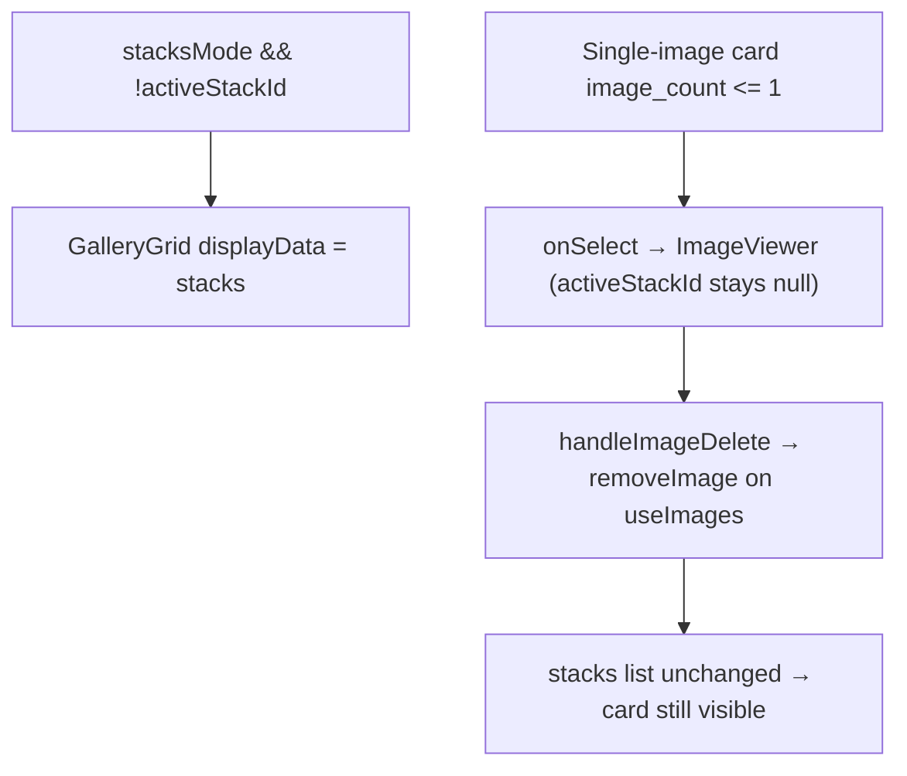

# Grid delete state sync (Stacks mode)

**Purpose:** When the operator permanently deletes an image from **ImageViewer** (red **Delete** → confirm), the underlying **GalleryGrid** must drop that row immediately on return to the grid — without a manual refresh.

**Fixed (2026-06-30):** In **Stacks mode** at folder level, deleting a **single-image** stack card left the thumbnail visible because delete updated the flat `useImages` list while the grid rendered `useStacks`.

## User-visible behavior

| View | After successful delete |
|------|-------------------------|
| Flat grid (Stacks off) | Image row removed from folder grid |
| Stacks mode, folder level | Stack card / singleton row removed |
| Inside a stack or sub-stack | Member thumbnail removed from drill-down grid |

Delete still runs `bridge.deleteImage` (file + `DELETE FROM images` via `db:delete-image` / `DELETE /db/image/:id`). Grid updates are **optimistic** local state only — there is no `image_deleted` WebSocket event.

## Root cause (pre-fix)

Singleton stack cards open the viewer directly ([`GalleryGrid.tsx`](../../../src/components/Gallery/GalleryGrid.tsx) — multi-image stacks call `onSelectStack` first). With `activeStackId` still `null`, delete targeted the wrong paginated hook.

## Routing (current)

[`AppContent.tsx`](../../../src/AppContent.tsx) centralizes removal in `removeImageFromActiveGrid`, passed to [`useImageOpener.ts`](../../../src/hooks/useImageOpener.ts) as `onImageRemoved`:

| Active view | Remover |
|-------------|---------|
| `stacksMode && !activeStackId` | `useStacks().removeStackByImageId(id)` |
| `activeStackId != null` (stack / sub-stack detail) | `useStacksMode().handleImageDeleteFromStack(id)` |
| else (flat folder grid) | `useImages().removeImage(id)` |

`removeStackByImageId` matches rows by **`id`** or **`rep_image_id`** so singleton cards (`stack_key = -imageId`) are removed correctly — `removeItem(stack_key)` alone would miss them.

## Primary code paths

| Layer | File | Role |
|-------|------|------|
| Viewer delete | [`ImageViewer.tsx`](../../../src/components/Viewer/ImageViewer.tsx) | `handleDeleteConfirm` → `onDelete(id)` |
| Viewer lifecycle | [`useImageOpener.ts`](../../../src/hooks/useImageOpener.ts) | `handleImageDelete` → `onImageRemoved(id)`; closes viewer |
| Grid routing | [`AppContent.tsx`](../../../src/AppContent.tsx) | `removeImageFromActiveGrid` |
| Flat list | [`useDatabase.ts`](../../../src/hooks/useDatabase.ts) | `useImages` / `removeImage` |
| Stack cards | [`useDatabase.ts`](../../../src/hooks/useDatabase.ts) | `useStacks` / `removeStackByImageId` |
| Stack members | [`useStacksMode.ts`](../../../src/hooks/useStacksMode.ts) | `handleImageDeleteFromStack` |
| Grid UI | [`GalleryGrid.tsx`](../../../src/components/Gallery/GalleryGrid.tsx) | `VirtuosoGrid` + `computeItemKey` by image `id` |
| Persistence | [`electron/db.ts`](../../../electron/db.ts) | `deleteImage` (unlink + SQL delete) |

## Regression tests

- [`src/hooks/useDatabase.test.tsx`](../../../src/hooks/useDatabase.test.tsx) — `removeStackByImageId` (singleton + rep-image stack rows)
- [`src/hooks/useImageOpener.test.tsx`](../../../src/hooks/useImageOpener.test.tsx) — `handleImageDelete` calls `onImageRemoved`

## Known follow-ups (not this fix)

- **Agent cull “Delete N approved…”** — batch delete refreshes review state only; grid lists are not pruned. Same `removeImageFromActiveGrid` pattern applies — see [guides/04-agent-cull-review.md](../../guides/04-agent-cull-review.md).
- **Navigate up after deleting last image in a multi-image stack** — folder-level stack card count/thumbnail may need `refreshStacks()` until a dedicated update lands.

## Related

- [02-desktop-shell-and-navigation.md](02-desktop-shell-and-navigation.md) — gallery grid, viewer, Stacks toggle
- [08-stack-substack-navigation.md](08-stack-substack-navigation.md) — stack/sub-stack drill-down levels and auto-open
- [06-culling-stack-analytics.md](06-culling-stack-analytics.md) — stack drill-down and agent cull surfaces
- [03-database-engine-modes.md](03-database-engine-modes.md) — `db:delete-image` IPC
- [guides/04-agent-cull-review.md](../../guides/04-agent-cull-review.md) — separate delete path for approved agent removals
