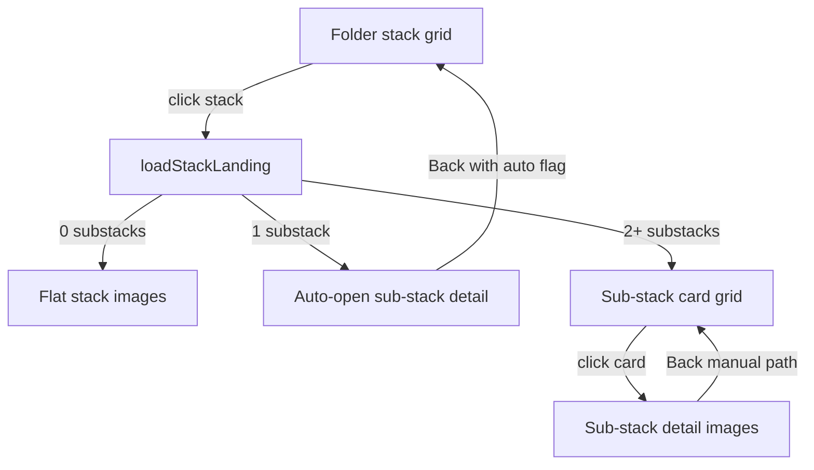

# Stack and sub-stack navigation

**Purpose:** In **Stacks mode**, operators drill from folder-level stack cards into root stacks, optional two-level culling **sub-stacks**, and finally member image thumbnails. When a root stack exposes only one sub-stack card, the gallery skips the redundant landing grid and opens that sub-stack's image view directly.

**Primary code:** [`src/hooks/useStacksMode.ts`](../../../src/hooks/useStacksMode.ts) (state + loading), [`src/AppContent.tsx`](../../../src/AppContent.tsx) (header, breadcrumbs, Back/Escape), [`src/components/Gallery/GalleryGrid.tsx`](../../../src/components/Gallery/GalleryGrid.tsx) (card rendering and click handlers).

## Drill-down levels

All levels reuse **GalleryGrid**; the active list comes from `useStacksMode` derived state:

| Level | Condition | Grid data | Header example |
|-------|-----------|-----------|----------------|
| Folder stacks | `stacksMode && !activeStackId` | `useStacks` paginated cards | Folder name |
| Stack landing | `activeStackId`, sub-stack cards visible | `subStacks` from `getSubstacksForStack` | `Stack #34747` |
| Sub-stack detail | `activeSubStackId` or ungrouped leaf | `subStackImages` | `substack_34747_1` |
| Flat stack (no sub-stacks) | `activeStackId`, zero sub-stack rows | `stackImages` from `getImagesByStack` | `Stack #N` |

Two-level culling persists named sub-stacks in the backend (`sub_stacks` table; names like `substack_{stackId}_{n}`). The gallery reads them via IPC — it does not generate sub-stack names.

## Opening a stack from the folder grid

1. Click a stack card with `image_count > 1` → `handleSelectStack` sets `activeStackId`.
2. `loadStackLanding(stackId)` calls `bridge.getSubstacksForStack`.
3. Landing resolution:

| `getSubstacksForStack` result | Behavior |
|------------------------------|----------|
| `[]` | Load flat stack images (`getImagesByStack`) |
| **Exactly 1 card** (named sub-stack or Ungrouped-only) | **Auto-open** sub-stack detail (see below) |
| 2+ cards | Show sub-stack card grid; manual click required |

Singleton stack cards (`image_count === 1`) open **ImageViewer** directly without setting `activeStackId`.

## Auto-open single sub-stack (2026-06-30)

When `loadStackLanding` receives exactly one sub-stack row, it:

1. Sets `singleSubStackAutoOpened = true`.
2. Calls `applySubStackSelection` (same path as a manual sub-stack card click).
3. Loads images via `getImagesBySubStack` or `getImagesByStackUngrouped` (ungrouped synthetic card).

This replaces an earlier **flat-stack skip** (`isSingleSubStackEquivalentToStack`) that jumped to `getImagesByStack` when counts matched — that path dropped sub-stack breadcrumbs, headers, and sub-stack-scoped agent cull review.

**Back navigation:** From an auto-opened sub-stack, **Back**, **Escape**, and the breadcrumb **Stack #N** click call `clearSubStack()`. When `singleSubStackAutoOpened` is set, that exits the entire stack (`clearStack`) so the operator returns to the folder stack grid instead of looping through a one-card landing.

Manual sub-stack selection from a multi-card landing clears `singleSubStackAutoOpened`; **Back** then returns to the sub-stack card grid as before.



## IPC / database calls

| Action | Bridge | IPC handler | DB function |
|--------|--------|-------------|-------------|
| List folder stacks | `getStacks` | `db:get-stacks` | `getStacks` |
| Stack landing | `getSubstacksForStack` | `db:get-substacks-for-stack` | `getSubstacksForStack` |
| Flat stack members | `getImagesByStack` | `db:get-images-by-stack` | `getImagesByStack` |
| Sub-stack members | `getImagesBySubStack` | `db:get-images-by-substack` | `getImagesBySubStack` |
| Ungrouped members | `getImagesByStackUngrouped` | `db:get-images-by-stack-ungrouped` | `getImagesByStackUngrouped` |

Filters from the sidebar (`toImageQueryFilters`) apply at each query layer.

## Regression tests

- [`src/hooks/useStacksMode.test.tsx`](../../../src/hooks/useStacksMode.test.tsx) — auto-open for single named sub-stack and ungrouped-only stacks; multi-card landing unchanged; back from auto-open clears `activeStackId`.

```bash
npm run test:run -- src/hooks/useStacksMode.test.tsx
```

## Related

- [02-desktop-shell-and-navigation.md](02-desktop-shell-and-navigation.md) — Electron shell, semantic search sidebar, Stacks toggle
- [06-culling-stack-analytics.md](06-culling-stack-analytics.md) — stack/sub-stack analytics banner and agent cull panel on drill-down views
- [07-grid-delete-state-sync.md](07-grid-delete-state-sync.md) — optimistic grid removal inside stack/sub-stack detail
- [guides/04-agent-cull-review.md](../../guides/04-agent-cull-review.md) — agent review at stack or sub-stack leaf
- Backend two-level culling: [PIPELINE_TERMINOLOGY.md](https://github.com/synthet/image-scoring-backend/blob/main/docs/technical/PIPELINE_TERMINOLOGY.md) (culling phase)
